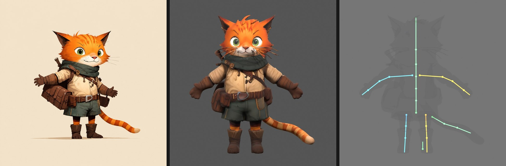
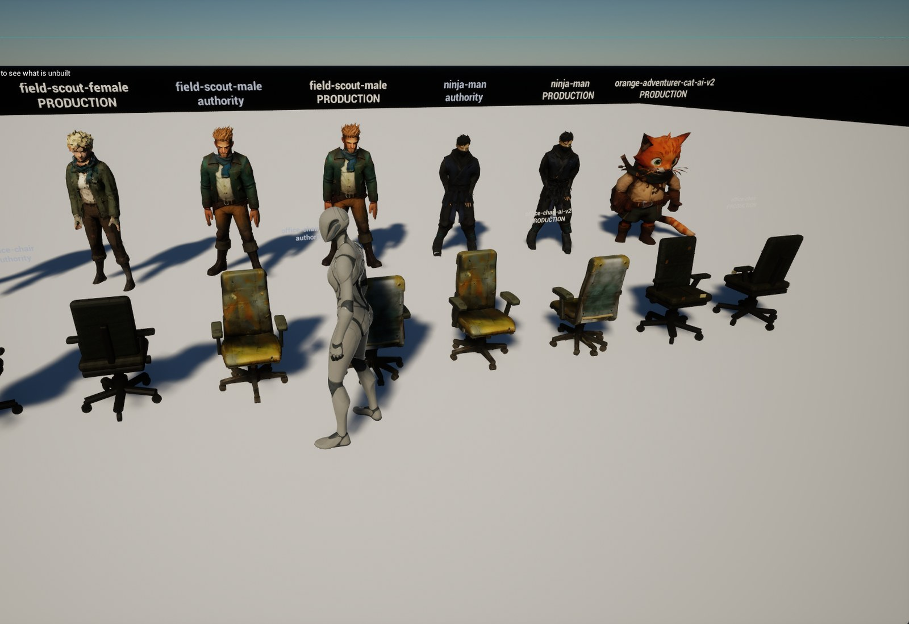
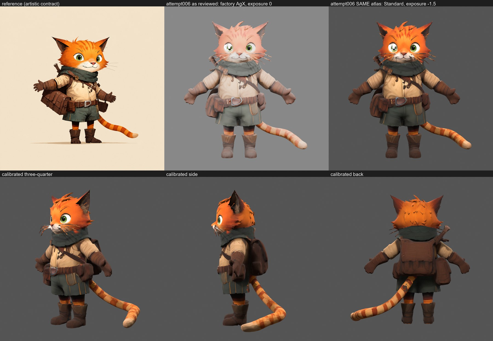
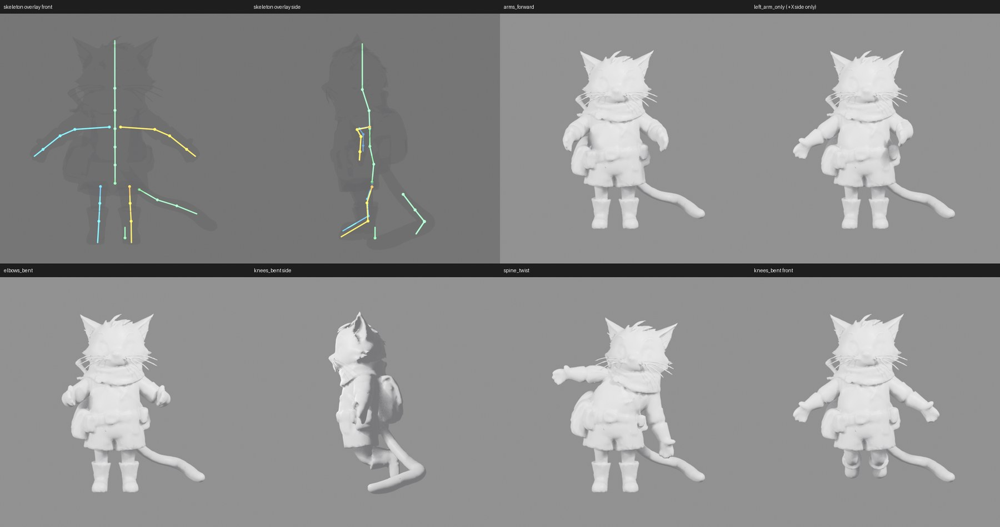
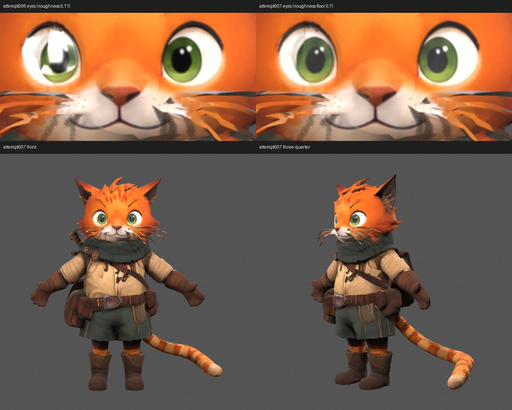
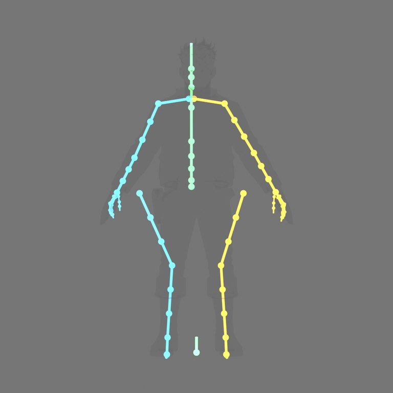

# Reference Asset Compiler

Scene utilities: [physical-unit atmosphere recipes, protected UE derivatives,
and portable pending-approval reviews](docs/SCENE_TOOLS.md). Start with
`python scripts/scene_tools.py --help`; planning needs no editor or GPU.

[](https://github.com/raydeStar/reference-asset-compiler/actions/workflows/tests.yml)


**Open-source, evidence-gated pipeline from one concept image to a rigged,
textured, animation-ready Unreal Engine 5 character.** AI image-to-3D
(Hunyuan3D) for geometry and PBR textures, Blender for retopology, UV, rigging
and deformation tests, UE 5.8 for import verification and a playable review
gallery, and a hash-bound ledger so every approval is reproducible. Rigging works
with or without Auto-Rig Pro. MIT licensed.

*Keywords: AI 3D character generation, image to 3D, Hunyuan3D 2.1, Blender
auto-rig, UE5 Manny skeleton, IK Retargeter, game-ready character pipeline,
indie game dev tools.*



*Left: the approved reference. Middle: the compiled payload, lit in Blender.
Right: the 26-bone mascot skeleton derived from the same evidence. The cat
walked from image to a playable UE 5.8 gallery in one working day with two
human approvals.*

This is not "one model call produces a finished character". AI systems propose
isolated candidates; an immutable reference image, fixed-view reviews, numeric
gates, deformation tests, and engine evidence decide what gets promoted. Every
stage writes a receipt with the SHA-256 of what it consumed and produced, and
the ledger refuses to advance past a gate that was not actually passed.

## What you get

| Stage | What runs | What you look at |
|---|---|---|
| Geometry | Direct Hunyuan3D single-view or multiview from the reference (historical ComfyUI graph preserved) | Clay front / three-quarter / side / back |
| Modeling approval | You, in the ledger | Same four views, your name on the receipt |
| Cleanup and retopology | Feature-aware QEM to a 20k-triangle quad-dominant budget, joint-ring guides fitted to the AI surface | Matcaps, wireframes, deviation numbers |
| Texturing | Hunyuan3D-Paint 2.1 on the exact UV-locked mesh, region-bounded fixes when landmarks drift | Unlit albedo and calibrated lit views |
| Rig | One command, either route: Auto-Rig Pro if installed, otherwise the free landmark rig (Manny-compatible humanoid or 26-bone mascot), 4 influences | Skeleton overlay, five-pose deformation suite |
| Engine | Compile to FBX + PNG + import manifest, headless UE5 import and payload verification | Playable gallery with Manny's idle retargeted onto every character |



*The end state: a UE 5.8 level you walk as Manny, every compiled character
looping a retargeted idle, each authority beside its production derivative.*



*The single most useful lesson of the project: judge textures on a calibrated
display transform. The first review render (top middle) was washed out by
Blender's factory AgX transform and showed a hard white glint that turned out to
be a mirror-glossy eye, not paint. The accepted attempt007 (top right, bottom
row) is the same base color under a calibrated transform with the eye roughness
lifted; that is what shipped to UE5.*



## Quick start

**New here? Read [docs/GETTING_STARTED.md](docs/GETTING_STARTED.md) first.**
It has the full "you will need" list so nothing surprises you, and walks from
a fresh clone to a walkable UE5 gallery step by step.

You need Windows, Python 3.11+, Blender 5.2 LTS, and Unreal Engine 5.8; about
5 GB of disk for the no-AI route. The AI stages additionally need an NVIDIA GPU
with 24 GB of VRAM, a local Hunyuan3D 2.1 checkout, and roughly 60 GB in total;
see *AI stages* below and the disk tiers in the getting-started guide.

```powershell
git clone <this repo> reference-asset-compiler
cd reference-asset-compiler
py -3.12 -m venv .venv
.\.venv\Scripts\python.exe -m pip install -e ".[dev]"
python scripts\rac_env.py --all          # where Blender and Unreal were found
.\scripts\workflow_doctor.ps1            # read-only report of every route
.\scripts\verify.ps1                     # 75 contract tests; must pass
```

If a tool is not found, point at it:

```powershell
$env:RAC_BLENDER    = "C:\path\to\blender.exe"
$env:RAC_UNREAL_CMD = "C:\path\to\UnrealEditor-Cmd.exe"
```

### Run it without Codex

Codex is an operator, not a runtime dependency. The resumable operator command
drives the same hash-bound PowerShell, Python, Blender, and Unreal stages:

```powershell
$env:RAC_LEGACY_ROOT = "D:\rac-studio"
python scripts\crank_from_image.py brass-lantern D:\art\lantern.png `
  --kind static_prop --height 0.55 `
  --height-reason "Measured against the 0.9 m table in the concept sheet."
```

It runs until the next visual gate, prints the exact review directory, and
stops. Inspect the four views, then rerun the same command with
`--approve-modeling-by "Your Name"`, `--approve-retopology-by "Your Name"`,
or `--approve-texture-by "Your Name"` as requested. Add `--import-ue5` on the
final run to import and verify the packaged payload in the local validation
project. `--prepare-only` writes and hashes the request without launching GPU
work.

This first operator route is wired end-to-end for **static props**; it has
passed request/preflight and contract tests but has not yet been certified by
a fresh full GPU-to-UE run. Humanoids and mascots use the same one-image
geometry intake and modeling review, but the command stops there: generic
deformation-aware retopology, hand landmarks, rig export, and motion proof are
not yet safe to automate. It does not call a triangle soup a character merely
because optimism is inexpensive.

### Try it on a mesh you already have (no AI, no GPU)

The static-prop route needs nothing but a mesh and a base color:

```jsonc
// recipes/my-crate.json
{
  "asset_id": "my-crate",
  "kind": "static_prop",
  "articulation": "static",
  "source": { "authority_fbx": "D:/art/crate.glb" },
  "material_textures": { "MAT-Crate": { "BaseColor": "D:/art/crate_basecolor.png" } },
  "normalize": {
    "mesh_name": "SM_Crate",
    "target_height_m": 0.6,
    "target_height_reason": "Measured against the character cohort, not guessed.",
    "recenter": true,
    "material_renames": { "MAT-Crate": "M_Crate_Body" }
  }
}
```

```powershell
python scripts\compile_prop.py recipes\my-crate.json     # join, scale, rename
python scripts\build_production.py my-crate               # heal, unwrap, bake, gate
python scripts\promote_production.py my-crate             # publish out\my-crate-production\
```

### Try it on a rigged character you already have

Write a recipe with `"kind": "mascot"` or `"humanoid"`, a `skeleton_profile`
from `profiles/skeletons/`, and `material_textures` with `BaseColor` and a
packed `ORM` (R occlusion, G roughness, B metallic), then:

```powershell
.\scripts\compile_asset.ps1 -Recipe recipes\my-character.json
```

That normalizes scale and origin, gates the skeleton against the profile,
measures texture quality, renders fixed views, runs the five-pose deformation
suite, and writes `out\my-character\my-character.ue5import.json`.

### See it in Unreal

Create the disposable validation project once (it copies the Third Person
Blueprint character, the Mannequin content and the Input pack from your own
engine install; nothing is redistributed):

```powershell
.\scripts\setup_ue5_project.ps1
```

Then import, build the gallery, retarget the idles, and play:

```powershell
$env:RAC_ROOT = (Get-Location).Path
$ue = python scripts\rac_env.py --unreal-cmd
& $ue .\work\ue5-validate\RacValidate.uproject -ExecutePythonScript="$env:RAC_ROOT\scripts\ue5\import_and_verify.py" -unattended -nop4 -nosplash -stdout
& $ue .\work\ue5-validate\RacValidate.uproject -ExecutePythonScript="$env:RAC_ROOT\scripts\ue5\build_gallery_level.py" -unattended -nop4 -nosplash -stdout
& $ue .\work\ue5-validate\RacValidate.uproject -ExecutePythonScript="$env:RAC_ROOT\scripts\ue5\setup_gallery_playable.py" -unattended -nop4 -nosplash -stdout
& (python scripts\rac_env.py --unreal-editor) .\work\ue5-validate\RacValidate.uproject -game -windowed -ResX=1920 -ResY=1080 -NoTextureStreaming
```

The first command imports every `out\<asset>\<asset>.ue5import.json` and
verifies what the engine actually built (height, materials, textures sampled,
LODs, texture settings). The second builds a lit gallery level with every
character on a floor. The third retargets Manny's `MM_Idle` onto every skeleton
and makes the level playable with the Third Person template character. The last
drops you in as Manny to walk the line. `RAC_ASSET_IDS=my-crate,my-character`
limits the import to named assets.

`work/ue5-validate` is ignored by Git; `setup_ue5_project.ps1` recreates it on
any machine with UE 5.8 installed (see `docs/UE5_VALIDATION.md`).

## The full image-to-engine route

This is what the cat went through. Each command refuses to overwrite an
attempt directory and writes a JSON receipt beside its output; the ledger
(`state.json` in the asset workspace) records which stage passed on what
evidence and who approved it.

```text
approved image
  -> rac new                              immutable reference, routing decision
  -> run_hy3d_geometry.ps1                isolated AI geometry candidate: single image, or
                                          three guidance views when you have them (Hunyuan3D)
  -> rac promote modeling_approval        YOU, on four clay views
  -> run_semantic_cleanup.ps1             conservative topology sanitation
  -> run_paired_feature_qem.ps1 /         20k-triangle quad-dominant retopology with
     run_feature_fairing.ps1              joint-ring guides, deviation measured
  -> rac promote production_retopology    YOU, on matcaps and wireframes
  -> run_texture_uv_prep.ps1              geometry-locked UV transport for the painter
  -> run_hy3d21_texture.ps1               Hunyuan3D-Paint 2.1, topology and UV gate 1e-6
  -> project_ai_reference_region.py       region-bounded landmark fix if the paint drifted
  -> clamp_region_roughness.py            PBR channel fix if the paint left eyes mirror-glossy
  -> render_turnaround.py ... calibrated  the views you actually judge on
  -> package_character_texture.py         PNG maps bound to the UV authority, texture gate
  -> rac promote texture_approval         YOU, on calibrated lit views
  -> run_rig_candidate.ps1                Auto-Rig Pro if installed, else landmark rig:
                                          derive_*_landmarks.py + rig_from_landmarks.py,
                                          then gate_rig.py and deform_test.py
  -> record_rig_and_skin.py,              ledger receipts
     record_deformation.py
  -> compile_asset.ps1                    production package + UE import manifest
  -> import_and_verify.py                 headless UE5 import, payload checks
  -> record_ue5_import.py                 ledger receipt
  -> build_gallery_level.py,              playable gallery with retargeted idles
     setup_gallery_playable.py
  -> record_ue5_motion_review.py          YOU, in the engine
  -> cook and record_cook_evidence.py     the only path to production_ready: true
```

Two decisions are yours and cannot be automated away: modeling approval and
texture approval. Everything else is scripted, measured, and rerunnable.
`docs/WORKFLOW_PLAYBOOK.md` walks through each stage with the exact commands;
`docs/HANDOFF.md` is the running record of the cat and the earlier assets.



*A typical bounded fix. The white shape on the left eye was not paint; the
painter had left the eye at roughness 0.11 and the key light mirrored off it.
One script lifted only the two eye regions to a 0.7 floor and recorded the
mask, the texel count, and the hashes.*

## AI stages: what you need and what is honest about them

- **Geometry** defaults to the hash-pinned Hunyuan3D-2/2mv Python runner. It does not
  execute a ComfyUI graph. The launcher only inspects a live ComfyUI queue so
  it will not steal the GPU from somebody else's job. The original ComfyUI
  geometry graph remains preserved as an optional historical route.
- **Texturing** uses the official Hunyuan3D-Paint 2.1 pipeline through
  `scripts/run_hy3d21_texture.ps1`, patched only to keep your UVs instead of
  rewrapping. It needs 21 GB of free VRAM and a `upstream/Hunyuan3D-2.1`
  checkout plus model weights beside the runner; the wrapper checks both and
  never auto-retries a crash.
- **Rigging** is either-or, chosen per run by `scripts/run_rig_candidate.ps1`:
  Auto-Rig Pro when your Blender has it (better binding on layered clothing,
  needs your licence and a reviewed hand-landmark file), otherwise the free
  landmark rig built into this repo. See *Rigging with or without Auto-Rig Pro*.
- **Texture upscaling** is not a separate default stage. The painter currently
  authors a 512 or 768 square atlas directly; RealESRGAN is an upstream paint
  dependency and must not be described as a proven final-texture upscaler here.
- **Wraparound-image generation** is not in the one-image operator. ComfyUI may
  later supply hash-bound guidance views for the multiview runner, but today the
  command uses the approved source image directly and infers the hidden side.
- **Retargeting** in the gallery builds IK Rigs from bone names and retargets
  `MM_Idle`, aligning limb chains to Manny and keeping spine and head at rest.
  Chain alignment cannot fix roll about a bone axis, so a character whose hands
  rest with a different palm orientation than Manny's will show twisted hands.
  Open `/Game/Compiled/Retargeted/<run>/Rigs/RTG_RAC_Manny_to_<Asset>` in the
  IK Retargeter and rotate `hand_l` / `hand_r` in the target retarget pose;
  the gallery script records which variant it chose and why.

`docs/AI_STAGES_SETUP.md` lists the studio tree the two AI stages expect, file
by file, with the hash-pinned runners copied from `workflows/`.

Nothing here redistributes model weights, licensed add-ons, Unreal Engine, or
the reference artwork.

### Measured AI install size

These are logical file sizes measured on the verified Windows installation on
2026-09-04, plus the exact files selected from the pinned shape-model
revisions—not estimates copied from model-card headlines:

| Component | Bytes | GiB |
|---|---:|---:|
| One pinned FP16 shape model (single-view or multiview) | 4,928,153,166-170 | 4.590 |
| Hunyuan3D-Paint 2.1 PBR weights | 6,887,589,708 | 6.415 |
| DINOv2 giant | 9,092,168,676 | 8.468 |
| Geometry Python environment | 5,970,391,978 | 5.560 |
| Paint Python environment | 7,025,227,469 | 6.543 |
| Two pinned upstream checkouts, including RealESRGAN | 762,405,455 | 0.710 |
| **Fresh one-image stack** | **34,665,936,452** | **32.285** |
| **Fresh stack with both shape models** | **39,594,089,622** | **36.875** |

The current DINO download contains both `pytorch_model.bin` and
`model.safetensors`; both are counted. The pinned geometry runners now request
only `config.yaml` and `model.fp16.safetensors`; upstream's broad single-view
download otherwise pulls five equivalent checkpoint files totalling
24,642,009,013 bytes (22.950 GiB). Keep **45 GiB free** for a one-image-only
installation, **50 GiB** for both geometry modes, or **60 GiB** if you also
want room for attempts and evidence. Run
`scripts\measure_ai_install.ps1 -StudioRoot D:\rac-studio` to measure the
actual installation rather than trusting this snapshot.

## Rigging with or without Auto-Rig Pro

```powershell
.\scripts\run_rig_candidate.ps1 -InputMesh .\work\hero\prod-v1\hero_production.fbx `
    -Profile ue5_manny -OutputDirectory .\work\hero\rig\attempt001
```

That one command probes Blender for Auto-Rig Pro. If it is operational and you
pass `-HandLandmarks`, it runs the Auto-Rig Pro candidate. Otherwise it derives
joints from the mesh itself: spine, neck and head at Manny's proportions with
depth from the mesh cross-sections; crotch, legs and arms from per-limb
centrelines; Manny's finger and metacarpal layout transplanted onto the measured
hand; twist bones at thirds; IK helpers where Manny has them. It builds the
skeleton, binds with heat weights (welded-proxy and envelope fallbacks), exports
FBX, and runs the same two gates either route must pass. `rig-route.json`
records which route ran and why. `-Backbone landmark` or `-Backbone arp` forces
a route.



*The free route on the field-scout male mesh with its armature stripped: 86
bones, passes the ue5_manny gate and the five-pose suite. Fingers are Manny's
layout fitted to the measured forearm, not a measurement; check the hand
overlay before trusting finger deformation.*

Honest comparison:

| | Auto-Rig Pro route | Landmark route |
|---|---|---|
| Cost | Paid Blender add-on, your licence | Free, in this repo |
| Inputs | Approved mesh + reviewed hand-landmark file | Approved mesh (+ joint-ring guides for mascots) |
| Binding | Pseudo-voxel; forgiving on layered clothing | Heat weights; falls back to a welded proxy, then envelope weights on meshes heat cannot solve |
| Fingers | From reviewed landmarks | From Manny's layout scaled to the hand |
| Gates | Same: `gate_rig.py`, `deform_test.py` | Same |
| Output | Candidate `.blend`, export via ARP game exporter | Rigged FBX directly |

## Known debts, stated plainly

These are recorded in `docs/DECISIONS.md` and the per-asset evidence, and they
are the honest edge of "99% of the way there":

- **Skeleton root scale.** Blender's FBX export leaves a 100x scale on the root
  bone with bone offsets in metres. UE renders and imports it correctly; any
  retargeter or physics tool that writes component-space centimetres into that
  local space will not. The gallery script compensates; the durable fix is a
  centimetre export, which touches every compiled asset.
- **Texel density and UV layout.** The 2048 Hunyuan atlas spreads to roughly
  20 texels/cm² on a Manny-scale body, and Smart Project produces confetti
  islands. Both are measured on every build and carried as a named waiver, not
  silently passed. A coherent semantic UV pass and a higher-resolution paint
  are the remedies.
- **Whiskers and thin detail** survive retopology as geometry spikes; texture
  follows them faithfully, which reads as brown sticks up close.
- **Two human gates** remain by design.

## Repository layout

```text
configs/        Adapter registry and generation requests; no machine-local paths
docs/           Playbook, pipeline, decisions, handoff, evidence JSON per asset
docs/images/    The screenshots in this README
profiles/       Hard gates: skeleton contracts, texture limits, retopology guides
recipes/        One per compiled asset: source, scale, materials, waivers, and why
schemas/        Portable JSON contracts
scripts/        The compiler
  blender/        Stages run inside Blender (retopo, UV, rig, deformation, renders)
  ue5/            Stages run inside Unreal (import, verify, gallery, retarget)
src/            Planner, immutable workspace, promotion ledger, audit CLI
tests/          Contract and tamper-detection tests (scripts\verify.ps1)
workflows/      Preserved generation entrypoints and the workstation routing catalog
out/, work/     Compiled packages and asset workspaces; ignored by Git, reproducible
```

## Resuming with an agent

The repository is written to be resumed by Claude Code, Codex, or a person
without chat history. Start with `CLAUDE.md`, then `docs/HANDOFF.md` for the
current asset matrix, exact artifact paths, and the next unresolved gate.
`docs/DECISIONS.md` lists what failed and why, so nobody repeats it.
`docs/AGENT_TASKS.md` lists scoped open work with acceptance criteria, split
into tasks that need a GPU and tasks that do not, so an agent or a contributor
can pick one up cold.

## License

MIT. Third-party models, tools, add-ons, artwork, and Unreal Engine retain
their own licenses.
